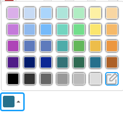

---

# svelte colour palette picker with HSV editor

For demo see [REPL](https://svelte.dev/repl/2a73898419014e96a607d070635445df?version=3.55.1)

No dependencies.  

This repository has two component in one package.  

1. A HSV colour picker supporting HSV and alpha.  

2. A Palette picker for preset colours. These preset colours can be edited by the end user using the HSV colour picker above.  The HSV Picker is integrated with this Palette Picker.

dispatches 'input' and 'change' messages - see REPL for example.

The HSV picker only handles `#RRGGBB` as a start value.  This is because it needs to parse it & convert it to a HSV value.  
The Colour Picker can handle most HTML colour specs - `RGB(r,g,b)` & `#RRGGBB.`  

## Licence

MIT
